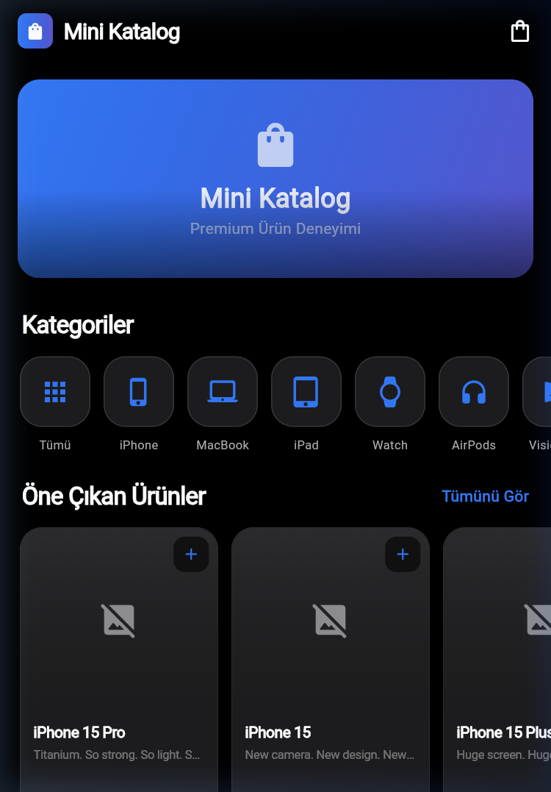
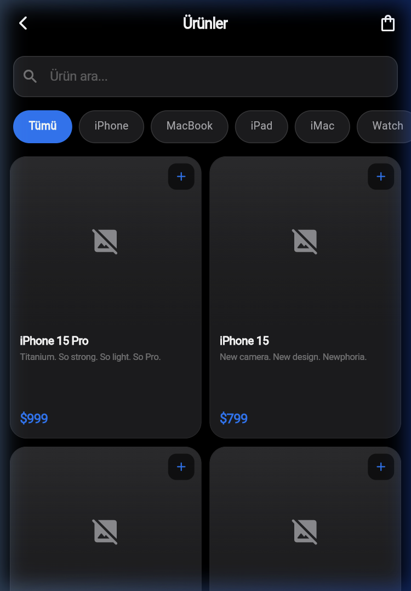
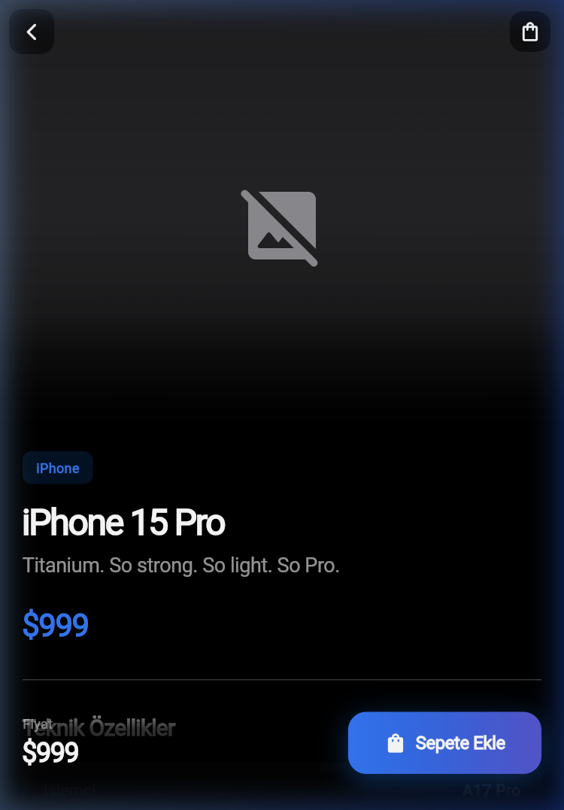
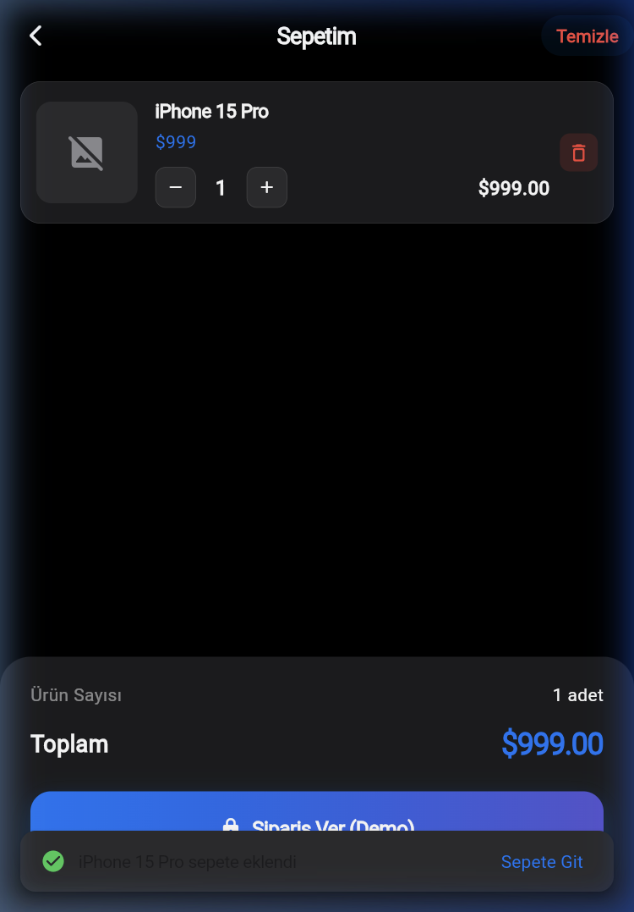

# 📱 Mini Katalog Uygulaması

> Flutter ile geliştirilmiş profesyonel bir Apple ürün kataloğu uygulaması.  
> **Eğitim Kapsamında Geliştirilen Haftalık Proje Çıktısı**

---

## 🎯 Proje Hakkında

**Mini Katalog**, Flutter framework'ü kullanılarak sıfırdan geliştirilen modern bir mobil uygulamadır. Uygulama, gerçek bir API'den (`wantapi.com`) Apple ürün verilerini çekerek kullanıcıya profesyonel bir alışveriş deneyimi sunar.

Bu proje; **widget yapısı**, **sayfa geçişleri**, **temel UI tasarımı**, **veri modeli oluşturma**, **API entegrasyonu** ve **proje klasörleme mantığını** öğretmeyi hedefler.

---

## ✨ Özellikler

| Özellik | Açıklama |
|---------|----------|
| 🏠 **Ana Sayfa** | Banner görseli, 9 kategori butonu, öne çıkan ürünler carousel |
| 🔍 **Arama & Filtreleme** | Gerçek zamanlı ürün arama ve kategori bazlı filtreleme |
| 📦 **Ürün Listesi** | GridView ile 2 sütunlu profesyonel ürün kartları |
| 📋 **Ürün Detay** | Hero animasyonlu görseller, teknik özellikler tablosu |
| 🛒 **Sepet Sistemi** | Ürün ekleme/çıkarma, adet güncelleme, toplam hesaplama |
| 🎨 **Premium Tasarım** | Apple tarzı dark mode tema, gradient tasarım |
| 🚀 **Animasyonlar** | Splash shimmer, Hero geçişler, staggered grid, slide+fade |
| 🌐 **API Entegrasyonu** | wantapi.com'dan 20 Apple ürünü çekme (JSON parse) |
| 📱 **5 Farklı Ekran** | Splash, Ana Sayfa, Ürün Listesi, Ürün Detay, Sepet |

---

## 🛠 Kullanılan Teknolojiler

| Teknoloji | Sürüm | Açıklama |
|-----------|-------|----------|
| **Flutter SDK** | `3.41.4` | Cross-platform mobil uygulama geliştirme framework'ü |
| **Dart** | `3.11.1` | Flutter'ın programlama dili |
| **material.dart** | Varsayılan | Flutter UI bileşen kütüphanesi |
| **http** | `^1.2.0` | API iletişimi için HTTP istemcisi |
| **Android Studio** | — | Emülatör ve derleme araçları |
| **VS Code** | — | Kod editörü |

---

## 🌐 Kullanılan API Kaynakları

> ⚠️ Bu adresler eğitim ve demo amaçlıdır, gerçek bir e-ticaret altyapısını temsil etmez.

| Kaynak | URL |
|--------|-----|
| 📦 Ürün Verileri | `https://wantapi.com/products.php` |
| 🖼️ Banner Görseli | `https://wantapi.com/assets/banner.png` |

API'den gelen her ürün şu bilgileri içerir:
- `id` — Benzersiz ürün numarası
- `name` — Ürün adı (ör: iPhone 15 Pro)
- `tagline` — Kısa slogan
- `description` — Detaylı açıklama
- `price` — Fiyat bilgisi (USD)
- `image` — Ürün görseli URL'i
- `specs` — Teknik özellikler (chip, ekran, kamera vb.)

---

## 📂 Proje Yapısı

```
mini_katalog/
├── 📁 lib/
│   ├── 📄 main.dart                      # Ana giriş noktası, tema, route tanımları
│   ├── 📁 models/
│   │   └── 📄 product.dart               # Ürün veri modeli (fromJson / toJson)
│   ├── 📁 services/
│   │   ├── 📄 api_service.dart           # API çağrıları (wantapi.com)
│   │   └── 📄 cart_provider.dart         # Sepet state yönetimi (ChangeNotifier)
│   ├── 📁 screens/
│   │   ├── 📄 splash_screen.dart         # 🚀 Animasyonlu açılış ekranı
│   │   ├── 📄 home_screen.dart           # 🏠 Ana sayfa (banner + kategoriler)
│   │   ├── 📄 product_list_screen.dart   # 📦 Ürün listesi (GridView + arama)
│   │   ├── 📄 product_detail_screen.dart # 📋 Ürün detay sayfası
│   │   └── 📄 cart_screen.dart           # 🛒 Sepet ekranı
│   └── 📁 widgets/
│       ├── 📄 product_card.dart          # Ürün kartı bileşeni
│       └── 📄 cart_badge.dart            # Sepet badge bileşeni
├── 📁 assets/images/                     # Lokal görseller
├── 📄 pubspec.yaml                       # Proje bağımlılıkları
├── 📄 analysis_options.yaml              # Lint ayarları
└── 📄 README.md                          # Bu dosya
```

---

## 🚀 Kurulum ve Çalıştırma Adımları

### 📋 Gereksinimler

- Flutter SDK `3.41.4` veya üzeri
- Dart SDK `3.11.1` veya üzeri
- Android Studio (Emülatör için) veya fiziksel Android cihaz
- VS Code (önerilen editör)

### ⚡ Hızlı Başlangıç

```bash
# 1️⃣ Repoyu klonlayın
git clone https://github.com/KULLANICI_ADI/mini-katalog.git

# 2️⃣ Proje dizinine gidin
cd mini-katalog

# 3️⃣ Bağımlılıkları yükleyin
flutter pub get

# 4️⃣ Uygulamayı çalıştırın
flutter run
```

### 🔧 Flutter Sürüm Kontrolü

```bash
flutter --version
# Flutter 3.41.4 • channel stable
# Dart 3.11.1 • DevTools 2.54.1
```

---

## 📸 Ekran Görüntüleri

| Splash Screen | Ana Sayfa | Ürün Listesi |
|:---:|:---:|:---:|
|  |  |  |

| Ürün Detay | Sepet |
|:---:|:---:|
|  |  |

---

## 🎨 Tasarım Detayları

### Renk Paleti

| Renk | HEX | Kullanım |
|------|-----|----------|
| 🔵 Primary Blue | `#007AFF` | Ana aksiyon rengi, butonlar |
| 🟣 Purple Accent | `#5856D6` | Gradient ve vurgular |
| ⚫ Background | `#000000` | Ana arka plan (Dark Mode) |
| 🔘 Surface | `#1C1C1E` | Kart ve bileşen arka planları |
| 🔲 Card | `#2C2C2E` | İkincil yüzeyler |
| 🟢 Success | `#30D158` | Başarılı işlemler |
| 🔴 Error | `#FF453A` | Hata ve silme işlemleri |

### Animasyon Sistemi

- **Splash:** Logo elastic scale + shimmer text efekti
- **Sayfa Geçişleri:** Custom Slide + Fade transition (400ms)
- **Grid:** Staggered fade-in animasyonları
- **Hero:** Ürün kartından detay sayfasına görsel geçişi
- **Butonlar:** Animasyonlu renk geçişi (sepete eklenince mavi → yeşil)

---

## 📚 Eğitim Kapsamında Öğrenilen Konular

- ✅ Flutter temel mimarisi ve widget ağacı
- ✅ Stateless ve Stateful widget farkları
- ✅ Dart syntax, değişkenler, fonksiyonlar
- ✅ Collection yapıları (List, Map)
- ✅ Navigator.push / pop ve Named Routes
- ✅ Route Arguments ile sayfalar arası veri taşıma
- ✅ JSON parse ve model sınıfı (fromJson / toJson)
- ✅ ListView.builder ve GridView.builder
- ✅ Image.network ile görsel yükleme
- ✅ Arama ve filtreleme mantığı
- ✅ State yönetimi (ChangeNotifier + InheritedWidget)
- ✅ HTTP API çağrıları
- ✅ Proje klasör yapısı ve dosya organizasyonu
- ✅ Asset yönetimi

---

## 👤 Geliştirici

Bu proje, **Flutter Günlük Eğitim** kapsamında geliştirilmiştir.

---

## 📄 Lisans

Bu proje eğitim amaçlı geliştirilmiştir.
